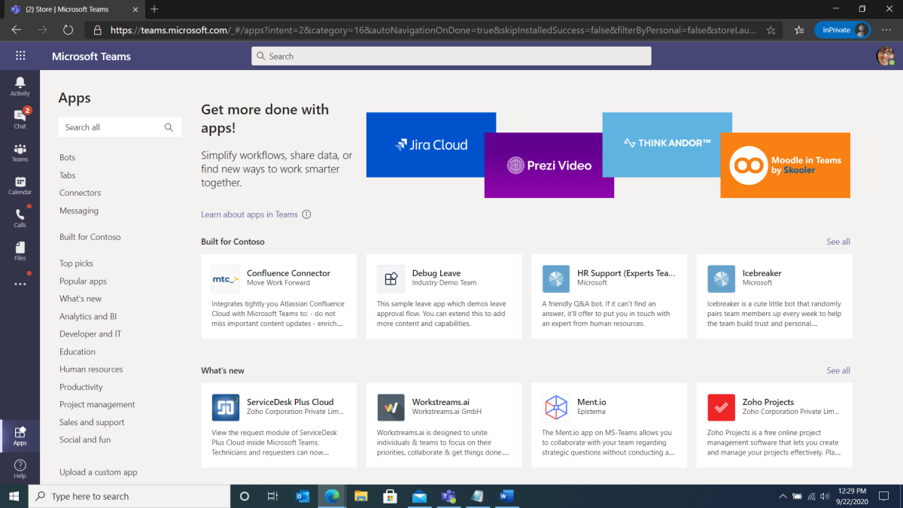

# Upload your app to Microsoft Teams
This document guides you on the process to upload your apps to your organization environment through different methods.

After you [create an app package](../build-and-test/apps-package.md), upload your app package and test the app experience within Microsoft Teams. After uploading, the package is available to all users of the selected team, and only users of that team.

Before uploading the app package, ensure that the [prerequisite](#prerequisite) is fulfilled. Now, use one of the following methods to upload your apps to Teams:
* [Upload using the Teams store](#upload-your-package-into-a-team-or-conversation-using-the-store)

> [!NOTE]
> If you upload an updated package for an existing app with a bot it might not show the tab changes when viewed through the conversation window. It is, therefore, recommended to access it through the Apps fly-out or test on a clean test environment.

## Prerequisite
The tenant administrator must first [enable uploading of custom apps](/microsoftteams/admin-settings) to successfully upload your app package and test it within the Teams environment. 

## Upload your package into a team or conversation using the Store
This section guides you through the steps to upload your app package using the App Store.

**To upload your app package**

1. In the lower left corner of Teams, choose the **Store** icon. On the **Store** page, choose **Upload a custom app**.

   

2. In the **Open** dialog, navigate to the package you want to upload and choose **Open**.
3. After the package is uploaded, select if you want to add it to a team or chat. 
   
    

   The uploaded package is available for use in the team or conversation specified in the consent dialog. 
   > [!NOTE]
   >If your app does not appear, the most common reason is an error in the manifest, particularly IDs for the app, bot, and messaging extensions. 
   If the app is not scoped for conversations, the **Add to a chat** option does not appear.

## Upload your package into a team using the Apps tab

>[!NOTE]
> **Apps** tab in conversations is currently in [Developer Preview](../../resources/dev-preview/developer-preview-intro.md), and the option does not appear if Teams is not running in that mode.

You can also upload your app package using the **Apps** tab.

**To upload your app package**

1. In the target team, choose **More options** (**&#8943;**) and select **Manage team**.

   > [!NOTE]
   > You must be the team owner or the owner must give access to users to add the appropriate app types for this functionality to appear.

2. Select the **Apps** tab, and then choose **Upload a custom app** on the lower right.

   

3. In the **Open** dialog, navigate to your .zip package, and then select it.
  
4. Select **Open** and your uploaded app appears in the list.

   

   > [!NOTE]
   > If your app does not appear, the most common reason is an error in the manifest, particularly IDs for the app, bot, and messaging extensions.

## Troubleshoot

If the manifest fails to load, check that you followed all the instructions in [create the app package](../../concepts/build-and-test/apps-package.md) and validated your manifest against the [schema](../../resources/schema/manifest-schema.md).

## Add a default install scope and group capability

> [!NOTE]
> The default install scope and group capability is currently available in developer preview only.

Although installing an app in the personal scope works for most apps, some of the apps in Teams Store support both personal and team scopes.
Some of these apps are intended to work in a team, meetings, or a groupchat, with personal app experience being secondary.
The default install scope selection helps you to specify the `defaultInstallScope` for the apps that you publish. The app installation experience makes the default options available to the user, while the rest is moved under the chevron as highlighted in the image.

The `defaultInstallScope` property supports values, such as personal, team, groupchat, or meetings.

> [!NOTE]
>`defaultGroupCapability` provides the default capability that is added to the team, groupchat or meetings. Choose a tab, bot, or connector as the default capability for your app, but you must ensure that you have provided the selected capability in your app definition.

## Remove or update your app

To remove your app, select the delete icon next to the app name in the **View Teams** bots list. If you change manifest information, first remove the app and then add the updated package. Code changes on your service do not require you to upload your manifest again. However, if the code changes require manifest updates, such as changes to the URL or the Microsoft app ID for its bot, you must upload the manifest again.

> [!NOTE]
> You cannot remove a bot from a personal context entirely. If the bot is removed and added again, additional communication with the bot appends to the previous conversation.

## See also

> [!div class="nextstepaction"]
> [Use the app](/office/apps-and-services-cc1fba57-9900-4634-8306-2360a40c665b?ui=en-us&rs=en-us&ad=us)

## Next step

> [!div class="nextstepaction"]
> [Publish to your orgranization](/MicrosoftTeams/manage-apps?toc=%2Fmicrosoftteams%2Fplatform%2Ftoc.json&bc=%2FMicrosoftTeams%2Fbreadcrumb%2Ftoc.json)
