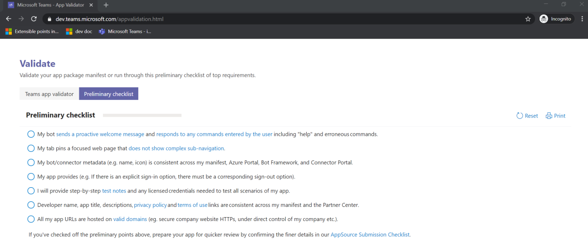

# Prepare for AppSource submission  

To be listed on AppSource, your app must go through an approval process. This is a free service provided by the Microsoft Teams group that verifies that your app works as described, contains all appropriate metadata, and provides content that would be valuable to an end user. To help you achieve rapid approval, ensure your app meets the following requirements and guidelines:

* **Distribution method:** Make sure your app is meant for publication on a store platform. There are [other options](../../overview.md) to distribute your app without publishing to AppSource.
* **Validation policies:** Your app must pass all current [AppSource validation policies](https://docs.microsoft.com/legal/marketplace/certification-policies#1140-teams) before submission. 
  > [!NOTE] 
  > The Appsource validation policies are subject to change.
* **Mobile readiness:** Your app must be mobile responsive. If your app contains tabs, they must follow the [mobile design guidelines](~/tabs/design/tabs-mobile.md) and your app must comply with [no upsell requirements](~/concepts/deploy-and-publish/appsource/prepare/frequently-failed-cases.md#-mobile-responsiveness-no-direct-upsell-or-payment) on mobile OS (iOS and Android).
* **Self test your app:** Test your app using the [Manifest validation tool](#teams-app-validation-tool).
* **App detail page:** Your app must align with the  [App detail page checklist](detail-page-checklist.md).
* **Tips and frequently failed cases:** Pay extra attention to the listed [Tips and frequently failed cases](frequently-failed-cases.md)  to improve your app submission and approval time.
* **App manifest:** Check your app manifest against the [App manifest checklist](app-manifest-checklist.md).
* **Testing and debugging:** Make certain that you have fully [tested and debugged your app](../../../build-and-test/debug.md).
* **Testing notes:** Include your [test notes for validation](#test-notes-for-validation)
* **Privacy policies:** Ensure your [privacy policy, terms of use and support URLs](#privacy-policy-terms-of-use-and-support-urls) follow our guidelines.

Once you have completed all of the above requirements, submit your package to AppSource through [Partner Center](/office/dev/store/use-partner-center-to-submit-to-appsource).

## Teams App Validation Tool

The app validation tool consists of an [app validator](#teams-app-validator) and a [preliminary checklist](#preliminary-checklist). The tool replicates the same test cases used by [AppSource](/office/dev/store/submit-to-appsource-via-partner-center) to evaluate your app submission. Therefore,  it's crucial to pass all the test cases prior to submitting your solution to AppSource for approval.The tool can be found in several areas within the Teams platform:

> [!div class="checklist"]
>
> * [**App Validator homepage**](https://dev.teams.microsoft.com/appvalidation.html)
> * [**Teams Visual Studio Code toolkit**](/toolkit/visual-studio-code-overview.md)
> * [**App Studio**](/concepts/build-and-test/app-studio-overview.md)

### Teams app validator

The **Validate** page allows you to check your app package before submission to AppSource. Simply upload your app package and the validation tool will check your app against all manifest-related test cases. For each failed test, the description provides a documentation link to help you fix the error.

### Preliminary checklist

For test scenarios that are difficult to automate, the preliminary checklist surfaces seven of the most commonly failed test cases.

## Privacy policy, terms of use and support URLs

### Privacy policy

Privacy policy guidelines:

> [!div class="checklist"]
>
> * The privacy policy can be specific to your app and/or an overall policy for all of your services.
> * If you use a generic privacy policy, it must reference "services", "applications", and "platforms" to include your Teams app as well as your website.
> * It must include how you handle user data storage, user data retention, deletion, and security controls.
> * It must include your contact information.
> * It should not contain broken links, beta URLs, or staging URLs.

### Terms of use

Your terms of use statement should be specific and applicable to your app and/or add-in offering.

### Support URLs

Your support URLs should not require authentication or login credential to contact you for any issues with your app.

## Test notes for validation

Please include the following:

* You must provide at least two login credentials, one admin and one non-admin.

* For verification purposes, the accounts you provide should have sufficient pre-populated data.

* For enterprise apps, apps where a subscription is required, or apps where there is an Office 365 tenant/domain dependency, you must provide a third account in the same domain that is not pre-configured for your app so that we can validate the first-run user experience.

* If your app has premium/upgraded features, an account with the necessary access must be provided to test that experience.

* You may choose to upload your test notes to SharePoint. If so, please provide a public link to the file.

* **Test Accounts**. A test account is required if your app only allows licensed accounts or safelisting from the backend. Also, if there is a team/group chat scope allowed in your app,  two test accounts in the same tenant are required to validate the team collaboration scenario.

* **Integration steps**. If pre-configuration by a tenant admin is required to use the app, include the steps and/or provide configured admin and non-admin accounts for validation. Note: you can sign up for an [Office 365 Developer Program](https://developer.microsoft.com/microsoft-365/dev-program) subscription. It's *free* for 90 days and will continually renew as long as you're using it for development activity.

* **Notes regarding the app features in Teams**: Detail all of the capabilities the app offers within Teams and steps for testing each feature.

* **Video showing the app functionality (Optional)**: You can provide a video recording of the product for us to fully understand the functionality of the app.
