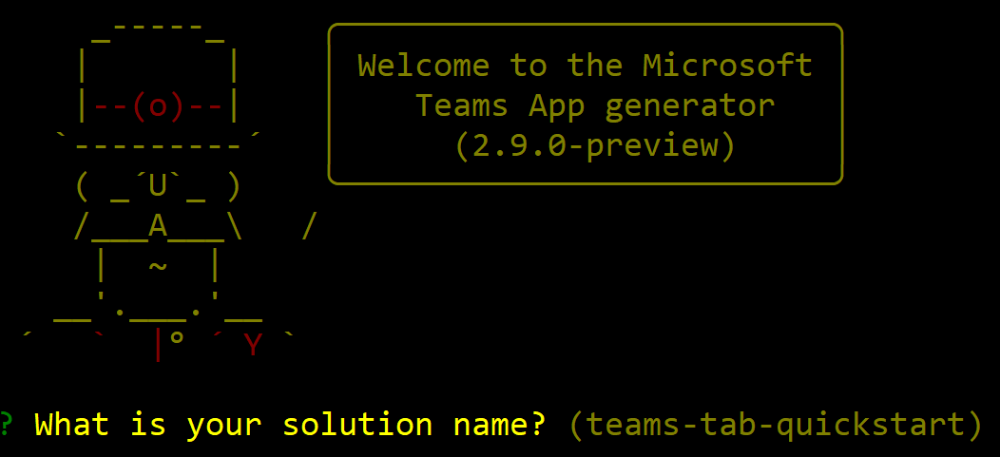
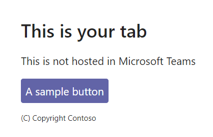

# Quickstart: build custom tabs with the Microsoft Teams Yeoman Generator

Custom tabs enable you to embed web-based content page directly into Microsoft Teams. You can build your own tab or expand your existing app's UI experience. Custom tabs can be scoped for either personal (static content) or group/channel (configurable/dynamic content) use. An app can have up to sixteen (16) personal or a maximum of one (1) group/channel tab.

## Prerequisites

In this quickstart we will walk through creating custom group/channel and personal tabs using the [Microsoft Teams App Project Generator](https://github.com/OfficeDev/generator-teams). For more information you can read the Microsoft Teams App [Project Structure](https://github.com/OfficeDev/generator-teams/wiki/Project-Structure) documentation. To complete this tutorial you need to have [enabled uploading of Microsoft Teams apps](https://docs.microsoft.com/en-us/MicrosoftTeams/enable-features-office-365) and have the following installed in your dev environment:

- [Node.js/NPM](https://nodejs.org/en/). You should use the latest LTS version. NPM (Node Package Manager) will get installed into your system with the installation of Node.js.

- Any text editor or IDE. You can install and use [Visual Studio Code](https://code.visualstudio.com/download) for free.

- After you have successfully installed Node.js and NPM, install the [Yeoman](https://yeoman.io/) and [gulp-cli](https://www.npmjs.com/package/gulp-cli) (Gulp global command line interface) packages by typing the following:

```cmd
         npm install yo gulp - cli--global
```

- If you want to install preview versions of the Teams generator type the following:

```cmd
        npm install generator - teams@preview--global
```

## Get Started

### Generate your project and create a group/channel tab

Open a command prompt and create a new directory for your tab project. Navigate (cd) to your new directory and type the command `yo teams` . This will display a classic ascii drawing and start the Teams Apps generator. Next, you will be asked a series of config questions:



> ***What is your solution name?*** <br>&emsp; This is your project name. You can accept the suggested name by pressing enter.<br>***Where do you want to place the files?*** <br>&emsp; You are currently in your project directory. Press enter.<br>***Title of your Microsoft Teams App project*** <br>&emsp; This title will be used in the manifest and description of your app. <br>***Your (company) name? (max 32 characters)*** <br>&emsp; Your company name will be used in the manifest.<br>***Which manifest version would you like to use*** <br>&emsp; For this tutorial select v1.5, the current general available schema.<br>***Enter your Microsoft Partner Id, if you have one? (Leave blank to skip)*** <br>&emsp;This field is not required, and should only be used if you are already part of the [Microsoft Partner Network](https://partner.microsoft.com) <br>***What do you want to add to your project?*** <br>&emsp; Select *( \* ) A Tab.*  <br>***The URL where you will host this solution?***  <br>&emsp; This can be any URL, but by default the generator suggests an Azure Web Sites URL. Note: As this is a demo and you will be testing locally, A valid URL is not necessary to complete this quickstart.<br>***Would you like to include Test framework and initial tests?*** (Y/n) <br>&emsp; For this quickstart choose <u>not</u> to include a test framework. The default is yes; enter **n**.<br>***Would you like to use Azure Applications Insights for telemetry?*** (Y/n) <br>&emsp; For this quickstart choose <u>not</u> to include [Azure Application Insights](https://docs.microsoft.com/azure/azure-monitor/app/app-insights-overview). The default is yes, so enter **n**.<br>***Default Tab Name (max 16 characters)*** <br>&emsp; Name your tab.<br>***Do you want this tab to be available in SharePoint Online?*** (Y/n) <br>&emsp; Select **n** unless, in the future, you want to use this app as a [SharePoint Online web part](https://docs.microsoft.com/microsoftteams/platform/concepts/tabs/tabs-in-sharepoint)

### Add some code to your group/channel tab

Your Tab logic is located in the `./src/app/scripts/<yourTabName>Tab/<yourTabName>Tab.tsx` . Locate the `render()` method and add the following div at the top of `<PanelBody>` :

```html
    <PanelBody>
        <div style={styles.section}>
        Hello World! Yo Teams rocks!
        </div>
    </PanelBody>
```

### Create your personal tab

If you do not want to add a personal tab to the app, you can skip this section of the quickStart. To include a personal tab:

> 1.&emsp; In your code editor, create a new HTML file named, `static.html` .  Add the following code to this file:

```html
<!DOCTYPE html>
<html>
    <head>
        <meta charset="UTF-8">
        <title>
            <!-- Todo: add your a title here -->
        </title>
        <meta name="viewport" content="width=device-width, initial-scale=1.0">
        <!-- inject:css -->
        <!-- endinject -->
    </head>
        <body>
            <h1>Static Tab</h1>
            <p></p>
            <p>This is your static tab!</p>
        </body>
</html>

```
> 2.&emsp;Save `static.html` file in your app's `web` folder as: <br>`./src/app/web/<yourAppName>Tab/static.html`


> 3.&emsp; In your code editor, navigate to your app's `manifest.json` file: `./src/manifest/manifest.json/` . Scroll down to the empty staticTabs array ( `"staticTabs":[]` ) and add the following JSON object:

```json
{
    "entityId": "staticTab",
    "name": "Static Tab ",
    "contentUrl": "https://{{HOSTNAME}}/<yourAppName>/static.html",
    "websiteUrl": "https://{{HOSTNAME}}",
    "scopes": ["personal"]
}

```

> 4.&emsp; Save the updated `manifest.json` file.

> 5.&emsp; Finally, your page must be served in an iFrame. In your code editor, navigate to your app's `Tab.ts` file: `./src/app/<yourAppName>Tab/<yourApptab>Tab.ts` and add the following to the list of iFrame decorators:

```typescript
 @PreventIframe("/<yourAppName>Tab/static.html")
```

> 6.&emsp; Save the updated `Tab.ts` file and Save all for good measure.

### Create a Teams App manifest and Build your app
Now that you have your tab code is complete, you can build your project:
>1.&emsp; The [Teams App manifest](https://docs.microsoft.com/microsoftteams/platform/resources/schema/manifest-schema) is part of the app package zip file that will be uploaded into Microsoft Teams. This task is achieved through a Gulp task that validates the manifest and creates the zip file in the ./package directory. Open your command prompt with the path to your project directory and type the following:

```cmd
gulp manifest
```

>2.&emsp; The build command will transpile your solution into the ./dist folder. To build your solution, type the following in your command prompt:

```cmd
gulp build
```

### Run your app in localhost
> 1.&emsp; To build and start a local web server type the following in your command prompt:

```cmd
gulp serve
```

> 2.&emsp; Enter `http://localhost:3007/<yourAppName>Tab/` in your browser and ensure that your tab renders properly:



### Run your app in Microsoft Teams

Microsoft Teams does not allow you to have your app hosted on localhost, so you need to either publish it to a public URL or use a proxy such as [ngrok](https://ngrok.com/docs) which will expose your local port to an internet-facing URL by creating a a tunnel to your local machine with a web endpoint. If you use the free version your app will only be available during the current session on your development machine. If the machine is shut down or goes to sleep the service will no longer be available.

### Accessing your tabs

To view tabs in the personal scope click the Apps icon in the left-hand menu of your Teams application. Tabs in the group/channel scope become part of a channel and the user configures the content of your tab experience when the tab is first added to the channel.

<footer>

[](https://www.npmjs.com/package/generator-teams)&emsp; &emsp; [](https://www.npmjs.com/package/generator-teams)

</footer>